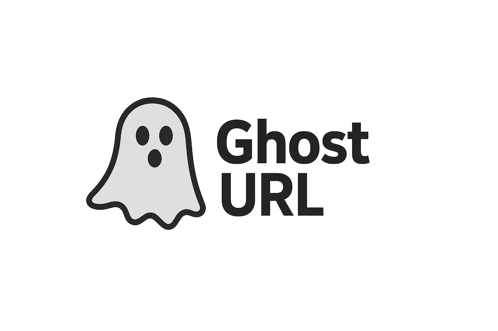

<p align="center">
  
</p>

# GhostURL
GhostURL is a program for collecting historical URLs and subdomains collected by the Wayback Machine. It uses the Wayback Machine CDX API and offers scans for single domains or archives of domains/subdomains. The ease of obtaining URLs for a target makes it an essential, useful, and indispensable tool for Read Team, Pentesting, and Bug Bounty tasks.
## Install
```bash
go install github.com/SkyLingRQ/ghosturl@latest
sudo mv go/bin/ghosturl /usr/bin
```
## Usage
```bash
Usage of GhostURL:
  -d string
    	Domain for the scan.
  -f string
    	File for the scan.
```
## Scan Single Domain
```bash
ghosturl -d example.com >> resultados.txt
```
## Scan Multiples Domains
```bash
ghosturl -f domains.txt >> resultados.txt
```
